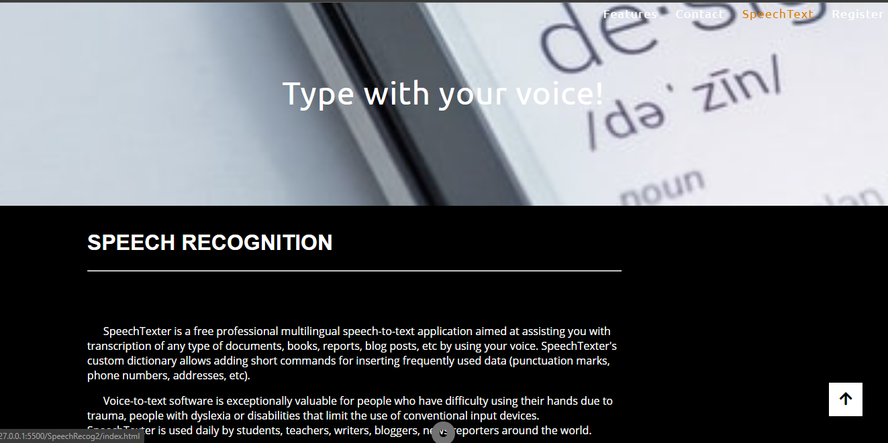

SpeechRecognition Web app is basically a voice-to-text multilinguial application which aims at assisting you with transcription of any type of documents, books, reports, blog posts, etc by using your voice.

This web application is extremely valuable for those people who have difficulty using their hands(& other disabilities) due to their own personal problems and for people who wish to go abroad for thier educational purposes but don't have a proper tool for improving and learning pronounciation of words in English language.

This application can be also be a time saviour for both students and teachers as it will assist them in minimising writing efforts significantly!

Below is the screenshot to get the feel of this beautiful SpeechTexter web app!

